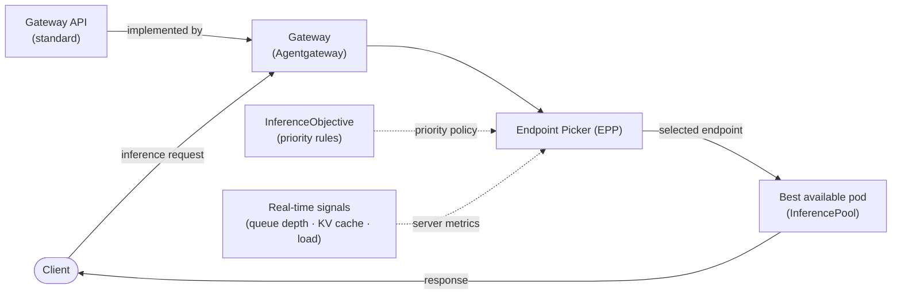
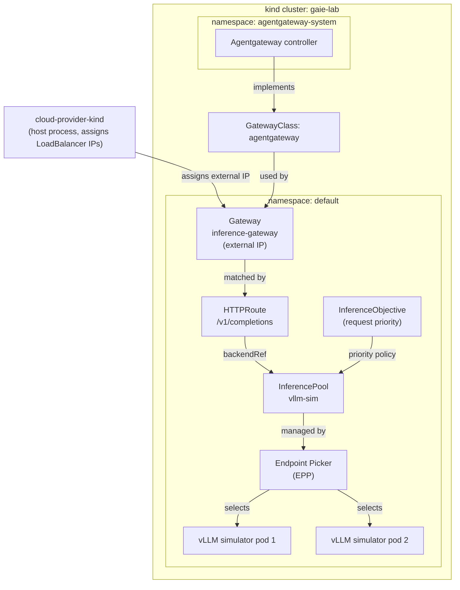
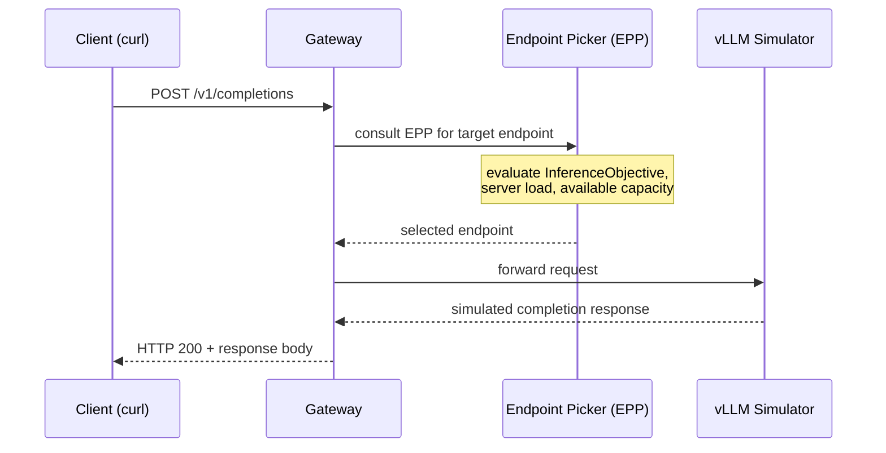

# Gateway API Inference Extension: Routing Hands-On (Agentgateway, no GPU)

> Reproducible lab: wire up model-aware request routing for LLM inference on Kubernetes,
> using the Gateway API Inference Extension (GAIE) with Agentgateway. Runs on kind. No GPU.
>
> **How to use this README:** the commands below are meant to be run directly, top to
> bottom. Run them one block at a time the first time, and watch what each does. The
> `scripts/` folder bundles the same commands for convenience once you've understood them
> (`setup.sh`, `test-routing.sh`, `cleanup.sh`).
>
> **⚠️ Agentgateway is beta and moves fast.** Versions and manifest paths change. Re-verify
> against the official docs before running:
> https://gateway-api-inference-extension.sigs.k8s.io/guides/getting-started-latest/
>
> **Tested with:** Agentgateway `v1.0.0`, GAIE `v1.5.0`, Gateway API `v1.5.0`, kind `v0.31.0` (2026-06-10)

---

## About this lab

Standard Kubernetes ingress controllers were designed for stateless HTTP services. LLM
inference breaks that assumption: requests have wildly variable cost (a one-token prompt vs.
a 128k context window are not the same thing), model servers accumulate state (KV cache),
and multi-tenant platforms need a way to express which workloads have priority when GPU
capacity is contended.

That accumulated state is the crux. The **KV cache** is the per-request computation a model
server has already done for the tokens it has seen; reusing it is what makes generation fast.
So routing a request to a pod that already holds the relevant prefix in cache avoids
recomputing it, while a round-robin load balancer, blind to that state, would scatter related
requests and throw the cache away. Inference routing is different precisely because the best
backend depends on what each server has already computed, not just on how busy it is.

The [Gateway API Inference Extension](https://gateway-api-inference-extension.sigs.k8s.io/)
(GAIE) is the Kubernetes SIG-network answer to this problem. It extends the standard Gateway
API with three new primitives:

- **InferencePool**: a group of model server pods exposed as a single routing target, with
  inference-aware metadata attached.
- **Endpoint Picker (EPP)**: a per-pool component that intercepts every request and selects
  the best backend pod based on real-time signals (queue depth, active requests, KV cache
  utilization).
- **InferenceObjective**: a cluster-scoped policy object that declares the priority of a
  given workload. When capacity is tight, the EPP uses it to decide which requests get
  served first.



This lab wires all three together on a local [kind](https://kind.sigs.k8s.io/) cluster,
using [Agentgateway](https://agentgateway.dev/) as the Gateway API data plane. A vLLM
simulator replaces a real model server so the lab runs without a GPU. By the end you will
have sent a real HTTP request through the full routing path and seen each Kubernetes object
play its role.

---

## What this lab is (and isn't)

**Is:** a working inference gateway on a laptop. Real GAIE primitives (Gateway, HTTPRoute,
InferencePool, Endpoint Picker), a request that traverses the full routing path, the
vLLM simulator standing in for a model server so it runs with no GPU.

**Isn't:** a performance benchmark. The simulator returns simulated output; it does not run
a model. This lab validates the routing PATH, not real inference speed. See "What this
proves / doesn't prove" at the end.

---

## Architecture overview



**Components:**

| Component | What it is |
|---|---|
| **cloud-provider-kind** | Host process that watches LoadBalancer Services in kind and assigns them a real IP from the host network. Without it, the Gateway never gets an address. |
| **GatewayClass** | Cluster-scoped object that declares a gateway implementation available. Here it points to Agentgateway as the controller. |
| **Agentgateway controller** | The control plane that programs the data-plane proxy. Implements the GatewayClass and watches Gateway objects. |
| **Gateway** | The actual L7 entry point, with an external IP. Clients send requests here. |
| **HTTPRoute** | Routing rule that matches `/v1/completions` and forwards traffic to an InferencePool (not a plain Service). |
| **InferencePool** | GAIE custom resource that groups model server pods and exposes them as a single routing target. The EPP is attached to it. |
| **Endpoint Picker (EPP)** | The brain of GAIE. A separate deployment the Gateway calls out to (via Envoy ext-proc) on every request; it returns the pod to route to, chosen from load, queue depth, KV cache, and InferenceObjective priority. |
| **InferenceObjective** | Declares request priority for a given workload. Which tenant or use-case wins when capacity is contended, expressed as an auditable Kubernetes object. |
| **vLLM simulator** | A drop-in fake vLLM server. Returns simulated output without loading a model or requiring a GPU. Used here to validate the routing path on a laptop. |

The key difference from a standard Kubernetes ingress setup: the HTTPRoute backend is an
**InferencePool**, not a plain Service. That one level of indirection is what lets the
Endpoint Picker make a per-request routing decision (load, priority, capacity) instead of
round-robin.

---

## How the Endpoint Picker actually decides

The diagrams show the request passing through the EPP, but the *mechanism* is the part worth
naming, because it's what makes GAIE different from a plain load balancer.

The EPP is not a sidecar injected into your model pods, and the Gateway does not route to it.
It's a **separate deployment** (the `vllm-sim-epp-...` pod from Step 7) that the Gateway
**calls out to** over gRPC, using **Envoy's external processing (ext-proc)** protocol. The
flow for every single request is:

1. The request hits the Gateway.
2. Before routing, the Gateway makes an ext-proc gRPC call to the EPP, handing it the request.
3. The EPP evaluates real-time signals (queue depth, active requests, KV cache, and the
   InferenceObjective priority) and **returns the exact endpoint** to use.
4. The Gateway forwards the request to that endpoint.

This is why the EPP can swap implementations the same way the GatewayClass can: any gateway
that speaks ext-proc and Gateway API can host it. And it's exactly what the response header
proves in Step 11: `x-inference-pod` names the pod the EPP picked, so you can point at the
decision instead of taking it on faith.

---

## Prerequisites

- [kind](https://kind.sigs.k8s.io/)
- [cloud-provider-kind](https://github.com/kubernetes-sigs/cloud-provider-kind): needed
  for LoadBalancer services to get an external IP in kind. Runs as a standalone binary on
  the host, needs privileges.
- Helm, kubectl, jq, curl
- **No GPU** (the vLLM simulator replaces a real model server)

---

## Quick start: using the scripts

> For those who have already read the README once. The scripts mirror the steps below
> exactly; use them to replay the lab without retyping every command.

**Prerequisites:** `kind`, `cloud-provider-kind`, `helm`, `kubectl`, `jq`, `curl` installed.
First, make the scripts executable, then run the prereqs installer:

```bash
chmod +x scripts/*.sh
./scripts/install-prereqs.sh
```

### 1. Run setup (cluster + all components)

```bash
./scripts/setup.sh
```

Creates the kind cluster, then pauses and asks you to start `cloud-provider-kind` in a
separate terminal before continuing. Follow the prompt.

> `cloud-provider-kind` requires an existing kind cluster to start; launch it only once
> the script has created the cluster and paused.

### 2. Start cloud-provider-kind (when prompted by setup.sh)

Open a second terminal and run:

```bash
sudo cloud-provider-kind --gateway-channel=disabled
```

Leave it running for the entire lab, then press enter in the first terminal to continue
the setup. This is what gives the Gateway an external address.

### 3. Test the routing path

```bash
./scripts/test-routing.sh
```

Resolves the Gateway address and sends an inference request through the full path
(Gateway → EPP → InferencePool → simulator). The simulator returns simulated output;
what is validated here is the **routing path**, not real model performance.

### 4. Clean up

```bash
./scripts/cleanup.sh
```

Deletes the manifests, uninstalls the Helm releases, and destroys the kind cluster. Then
stop `cloud-provider-kind` in its terminal (`Ctrl+C`).

---

## Step 1: Create the cluster

```bash
kind create cluster --name gaie-lab
kubectl get nodes   # all nodes should be Ready
```

Then, in a **separate terminal**, start cloud-provider-kind and leave it running:

```bash
sudo cloud-provider-kind --gateway-channel=disabled
```

The `--gateway-channel=disabled` flag prevents cloud-provider-kind from trying to install its
own Gateway API CRDs; we installed a newer version in Step 3, and the
`ValidatingAdmissionPolicy` installed alongside them blocks any downgrade attempt.

This is what lets your Gateway get an external address later. If you skip it, the Gateway
stays pending forever.

---

## Step 2: Pin the GAIE release

The official guide resolves the latest stable release automatically. Do the same:

```bash
IGW_RELEASE=$(curl -s https://api.github.com/repos/kubernetes-sigs/gateway-api-inference-extension/releases \
  | jq -r '.[] | select(.prerelease == false) | .tag_name' \
  | sort -V | tail -n1)
echo "Using GAIE release: ${IGW_RELEASE}"
```

> Record the value of `${IGW_RELEASE}` in this README's "Tested with" line after the lab.

---

## Step 3: Install the CRDs

Gateway API CRDs (the base), then the Inference Extension CRDs:

```bash
# Gateway API standard CRDs (verify the version against the Gateway API releases page)
kubectl apply -f https://github.com/kubernetes-sigs/gateway-api/releases/download/v1.5.0/standard-install.yaml

# Inference Extension CRDs
kubectl apply -f https://github.com/kubernetes-sigs/gateway-api-inference-extension/releases/download/${IGW_RELEASE}/manifests.yaml

# Verify: you should see inference.networking.k8s.io CRDs (InferencePool, InferenceObjective, ...)
kubectl get crds | grep inference.networking
```

> If the `manifests.yaml` path 404s (beta, paths move), check the release assets at
> https://github.com/kubernetes-sigs/gateway-api-inference-extension/releases and adjust.

---

## Step 4: Deploy the vLLM simulator (no GPU)

```bash
kubectl apply -f https://github.com/kubernetes-sigs/gateway-api-inference-extension/raw/main/config/manifests/vllm/sim-deployment.yaml

# Watch the simulator pods come up
kubectl get pods -w
```

The simulator (`llm-d-inference-sim`) mimics a vLLM server without loading a model and
without a GPU. This is what makes the lab reproducible on a laptop.

> Deployment label: `app: vllm-qwen3-32b`. Image: `ghcr.io/llm-d/llm-d-inference-sim:latest`.
> The InferencePool `matchLabels.app` must be set to `vllm-qwen3-32b` to select these pods.

---

## Step 5: Install Agentgateway (beta, re-verify version)

```bash
AGW_VERSION=v1.0.0   # RE-VERIFY at agentgateway.dev / cr.agentgateway.dev before running

# Agentgateway CRDs
helm upgrade -i --create-namespace --namespace agentgateway-system --version ${AGW_VERSION} \
  agentgateway-crds oci://cr.agentgateway.dev/charts/agentgateway-crds

# Agentgateway control plane, with the inference extension enabled
helm upgrade -i --namespace agentgateway-system --version ${AGW_VERSION} \
  agentgateway oci://cr.agentgateway.dev/charts/agentgateway --set inferenceExtension.enabled=true

# Verify the GatewayClass is accepted
kubectl get gatewayclass agentgateway
```

> Beta checks (these changed recently, confirm at the source):
> namespace is `agentgateway-system`, controller name is `agentgateway.dev/agentgateway`,
> policies use `AgentgatewayPolicy`.

---

## Why installing Agentgateway took three steps

Not an accident: the configuration is split across three levels because they're three
separate concerns, and that separation *is* the Gateway API's whole point:

1. **The controller** (Helm, `agentgateway-system`): the control plane. The
   `--set inferenceExtension.enabled=true` flag is what makes it inference-aware; without
   it, you get a plain gateway.
2. **The GatewayClass** (`agentgateway`, cluster-scoped) declares the implementation
   available and names its controller.
3. **The Gateway** (`inference-gateway`): the concrete L7 entry point that references the
   class by name and gets an external IP.

(See the *Architecture overview* diagram above for how these chain together.)

**Why it matters:** swap Agentgateway for Istio or NGINX Gateway Fabric and you change only
the GatewayClass. The HTTPRoute, the InferencePool, and the EPP stay exactly as they are.
The routing logic doesn't move; only the implementation underneath does.

---

## Step 6: Deploy the Gateway

```bash
kubectl apply -f https://github.com/kubernetes-sigs/gateway-api-inference-extension/raw/main/config/manifests/gateway/agentgateway/gateway.yaml

# The Gateway should get an ADDRESS and become PROGRAMMED=True (thanks to cloud-provider-kind)
kubectl get gateway inference-gateway
```

> If ADDRESS stays empty or PROGRAMMED=False: confirm cloud-provider-kind is running in its
> terminal, and check the agentgateway controller logs in `agentgateway-system`.
> Observed: `ADDRESS=172.18.0.3`, `PROGRAMMED=True`.

---

## Step 7: Install the InferencePool + Endpoint Picker (EPP)

This is the heart of GAIE. The Helm chart installs the EPP (the component that makes the
routing decision) and the InferencePool together.

```bash
export INFERENCE_POOL_NAME=vllm-sim
export GATEWAY_PROVIDER=none   # agentgateway uses provider.name=none per the GAIE docs

helm install ${INFERENCE_POOL_NAME} \
  --dependency-update \
  --version ${IGW_RELEASE} \
  --set inferencePool.modelServers.matchLabels.app=vllm-qwen3-32b \
  --set provider.name=${GATEWAY_PROVIDER} \
  --set inferencePool.modelServerType=vllm \
  --set inferencePool.modelServerProtocol=http \
  --set experimentalHttpRoute.enabled=true \
  oci://us-central1-docker.pkg.dev/k8s-staging-images/gateway-api-inference-extension/charts/inferencepool

# Verify
kubectl get inferencepool ${INFERENCE_POOL_NAME} -o yaml   # expect Accepted=True, ResolvedRefs=True
kubectl get pods | grep epp                                # the Endpoint Picker pod
kubectl get httproute                                      # the chart may have created it (experimentalHttpRoute.enabled)
```

> `matchLabels.app` MUST match the simulator label from Step 4 (`vllm-qwen3-32b`).
> Chart version: `v1.5.0` (matches `${IGW_RELEASE}`). HTTPRoute auto-created by the chart.
> InferencePool status: `Accepted=True`, `ResolvedRefs=True`.

---

## Step 8: HTTPRoute (only if not auto-created)

Check first:

```bash
kubectl get httproute
```

If an HTTPRoute already exists (from Step 7), skip this step. Otherwise apply the example
from the GAIE repo and verify it points its `backendRef` at the InferencePool (not a Service):

```bash
# Verify status
kubectl get httproute <name> -o yaml   # expect Accepted=True, ResolvedRefs=True
```

The key idea: the HTTPRoute's backend is an **InferencePool**, not a plain Service. That
indirection is what lets the Endpoint Picker choose the target per request.

---

## Step 9: InferenceObjective (request priority, the FinServ angle)

```bash
kubectl apply -f https://github.com/kubernetes-sigs/gateway-api-inference-extension/raw/main/config/manifests/inferenceobjective.yaml
kubectl get inferenceobjective -o yaml
```

This is the piece worth dwelling on for a regulated, multi-tenant context: it declares
request **priority**. Which workloads win when GPU capacity is contended, expressed as a
reviewable, auditable Kubernetes object. The inference-layer echo of DRA's Prioritized List
and of treasury multi-tenancy quotas: intent as config, not hard-coded.

---

## Step 10: Verify everything is ready

Before sending a request, confirm that every component is up and correctly wired.

```bash
kubectl get gateway inference-gateway
```
Expected: `ADDRESS` populated and `PROGRAMMED=True`:
```
NAME                CLASS          ADDRESS      PROGRAMMED   AGE
inference-gateway   agentgateway   172.18.0.3   True         18s
```

```bash
kubectl get pods
```
Expected: all pods `Running` (Agentgateway proxy, three vLLM simulator pods, EPP):
```
NAME                                READY   STATUS    RESTARTS   AGE
inference-gateway-f94cbcb59-2q6w7   1/1     Running   0          9s
vllm-qwen3-32b-84dc79d95c-kzgxq     1/1     Running   0          22s
vllm-qwen3-32b-84dc79d95c-n8z9q     1/1     Running   0          22s
vllm-qwen3-32b-84dc79d95c-tlnfw     1/1     Running   0          22s
vllm-sim-epp-df4c94d97-bz6dz        1/1     Running   0          16s
```

```bash
kubectl get httproute
```
Expected: the HTTPRoute created by the InferencePool Helm chart:
```
NAME       HOSTNAMES   AGE
vllm-sim               16s
```

```bash
kubectl get inferencepool vllm-sim -o yaml | grep -A10 "status:"
```
Expected: `Accepted=True` and `ResolvedRefs=True`:
```
status:
  parents:
  - conditions:
    - message: InferencePool has been accepted by controller agentgateway.dev/agentgateway
      reason: Accepted
      status: "True"
      type: Accepted
    - message: All InferencePool references have been resolved
      reason: ResolvedRefs
      status: "True"
      type: ResolvedRefs
```

If any of these checks fail, do not proceed; troubleshoot before sending traffic.

---

## Step 11: Send a request through the gateway



```bash
IP=$(kubectl get gateway/inference-gateway -o jsonpath='{.status.addresses[0].value}')
curl -i ${IP}:80/v1/completions -H 'Content-Type: application/json' -d '{
  "model": "dummy-model-name",
  "prompt": "Write as if you were a critic: San Francisco",
  "max_tokens": 100,
  "temperature": 0
}'
```

The request traverses Gateway -> EPP (routing decision) -> InferencePool -> simulator. The
simulator returns simulated output.

Response observed during the lab:

```
HTTP/1.1 200 OK
server: fasthttp
content-type: application/json
x-inference-port: 8000
x-inference-pod: vllm-qwen3-32b-84dc79d95c-tlnfw
x-went-into-resp-headers: true
transfer-encoding: chunked

{"id":"cmpl-f747c01a-3148-58b9-981d-a4a235838830-0","model":"dummy-model-name",
 "object":"text_completion","created":1781124131,
 "usage":{"prompt_tokens":10,"completion_tokens":56,"total_tokens":66},
 "choices":[{"index":0,"finish_reason":"stop",
   "text":"Testing@, #testing 1$ ,2%,3^, [4&*5], 6~, 7-_ + (8 : 9) / \\ < > .
           The rest is silence. Give a man a fish and you feed him for a day; "}]}
```

Two headers are worth noting: `x-inference-pod` names the exact pod the EPP selected
(`vllm-qwen3-32b-84dc79d95c-tlnfw`), and `x-inference-port` confirms the target port.
These prove the request went through the full path: Gateway → EPP routing decision →
InferencePool → simulator pod.

---

## Step 12: Cleanup

```bash
./scripts/cleanup.sh
# or manually:
helm uninstall ${INFERENCE_POOL_NAME} --ignore-not-found
helm uninstall agentgateway -n agentgateway-system --ignore-not-found
helm uninstall agentgateway-crds -n agentgateway-system --ignore-not-found
kind delete cluster --name gaie-lab
# then stop cloud-provider-kind in its terminal (Ctrl+C)
```

---

## What this lab proves / doesn't prove

**Proves:** the GAIE primitives wire together on a real cluster; a request traverses the
full path (Gateway -> EPP -> InferencePool -> backend); model-aware routing is configurable
declaratively.

**Does NOT prove:** real inference performance. The simulator returns simulated output, no
model, no GPU. The actual latency/utilization gains of smart load balancing only show up
with real models under real load on GPUs. See the official GAIE benchmarks (cite, don't
reproduce).

What the lab made concrete. Three things stopped being abstract once I ran it. First, the InferencePool indirection: reading that "the backend is a pool, not a Service" is one thing, but seeing the x-inference-pod header name the exact pod the EPP chose makes the routing decision tangible: you can point at it. Second, the operational reality of beta: the cloud-provider-kind gateway-channel conflict cost me real time, and it's exactly the kind of friction no quickstart warns you about. Third, how little of this is actually new to a platform engineer: it's the Gateway API you already know, with three inference-aware objects bolted on.
What stayed abstract. The reason GAIE exists, smarter routing that cuts latency and lifts GPU utilization, is precisely what the simulator can't show. The EPP made a routing decision, but with a fake backend under no real load, that decision was trivial. The real payoff lives in production: real models, real queue depth, real KV-cache pressure. This lab proves the plumbing works. Whether the intelligence pays off is a question only a GPU cluster under load can answer and that's the honest line between what I tested and what I read.

---

## A note on beta

Agentgateway is young and moving fast. Some commands here will break as the project evolves;
that's the nature of working at the edge of the cloud-native AI stack. The point isn't a
frozen tutorial; it's documenting the terrain as it forms, and being explicit about what's
still moving.

- GAIE: https://gateway-api-inference-extension.sigs.k8s.io/
- Agentgateway: https://agentgateway.dev/

---

*Part of an ongoing series on how Kubernetes is becoming the substrate for AI workloads.
Previous: From GPU Allocation to Distributed Inference (llm-d).*
